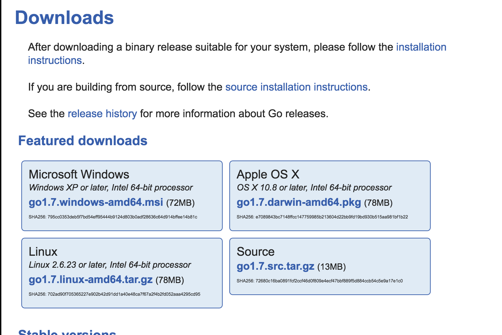

#Setup Go


Thank you for joining the the course. The first steps is to get your environment setup.

>###Anki Flash Cards!
>If you haven't already download and install anki from ankiweb.net and start using the following deck:
https://ankiweb.net/shared/info/419344943


##Setup
Follow the instructions from 
>https://golang.org/doc/

###Steps:

1. Go to https://golang.org/dl/
2. Download the version for your distro and install it



3) Export your go directory  


##Check your installation

In the 00-Initial-Setup folder run the following command:

```
> go run 00-1-TestGo.go
hello, world
```
If you see hello, world your environment is good!

##Pro TIPS
>Type go in the terminal to get further info
>
>		Go is a tool for managing Go source code.
>		Usage:
>		build       compile packages and dependencies
>		install     compile and install packages and dependencies
>		run         compile and run Go program
>		version     print Go version

If your installation is not workin make sure your go environment has been exported. 

If it was working before and It might be the case that you have setup the environment variables temporarily. 

