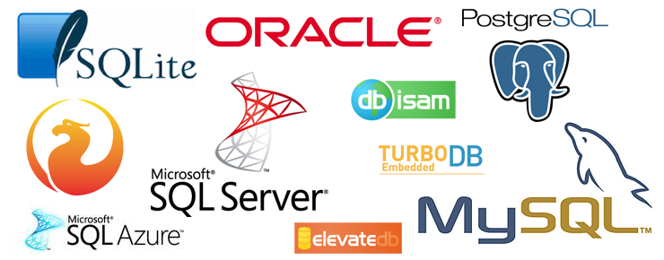

Base Header Level: 1
Title: GoRestFullAPI
Author: scalabilitySherpa.com

ScalibilitySherpa.com

![][mountainlogo.png]

![][ScreenShot2016-08-15at3.54.12PM.png]

Google GO Backend 

Problem
Scalabilitysherpa.com is expanding its footprint and needs expand their infrastructure. Currently the website is serving videos using a tightly coupled MERN stack. The company would like a more modern approach to persist data, while at he same time fit within their current front end. 

![][ScreenShot2016-08-15at2.05.14PM.png]

Users- The website needs to track each individual users progress throughout the website, if they are paid or free content only. 

Videos - Videos should contain a title, location of links , number of views.

Operational restrictions: The database needs to be secure, backups need to be provided as part of this service infrastructure change. 

User login is handled by a third party OATH service and no passwords or personal information should live in the Database. 

![][ScreenShot2016-08-15at4.04.17PM.png]

Current Infrastructure
Tightly coupled react framework with MYSQL backend. 

![][ScreenShot2016-08-15at5.23.12PM.png]

Proposed Solution
Restfull endpoint. 

![][ScreenShot2016-08-15at5.28.40PM.png]

RESTful API ENDPOINTS
http://api.scalabilitysherpa.com/api/v1/

Resource , get, post, put, delete
/Users, returns list of all users, create new user, bulk update users, delete all
/Users/11/ , returns a user, 405 (not allowed), updates user, deletes user 
![][ScreenShot2016-08-15at5.25.35PM.png]
Examples
How to retrieve all users
1
2
3
45
CURL –X POST \
-H "Accept: application/json" \
-d '{"state":"running"}' \
https://api.scalabilitysherpa.com/api/v1/users

How to retrieve a single user
1
2
3
45
CURL –X POST \
-H "Accept: application/json" \
-d '{"state":"running"}' \
https://api.scalabilitysherpa.com/api/v1/user/2863

Partial Answers

Retrieve the first user with first name matching xyz 
1
2
3
4
5
6
7
8
GET /users?firstname=xyz
200 OK
{
"id":"007",
"Firstname”:”xyz”,
“LastName”:”Bond",
“AccountType”: “premium”, 
“Videos”:”[002,004,0783,0889]”
}

Sorted Queries
Add sorted queries capability to the endpoint. 

Searching
Add searching capability to the endpoint.

Security 

	1.	 OAuth2 to secure your API endpoint. 

Notes
Maybe we can implement the following:
	•	API – https://api.{fakecompany}.com
	•	OAuth2 – https://oauth2.{fakecompany}.com
	•	Developer portal – https://developers.{fakecompany}.com

RESTful API Resources
https://en.wikipedia.org/wiki/Representational_state_transfer
http://blog.mwaysolutions.com/2014/06/05/10-best-practices-for-better-restful-api/

http://blog.octo.com/en/design-a-rest-api/

Backend 
Written in GO to take advantage of concurrency, speed, and reliability. 

Database Selection 

Current database is in MYSQL but there is room to choose another one since the number of videos and users is small. 

![][redislogo.png]

Schema Design

Users -
![][databaseplaceholder.png]
Videos -

Database Backup 

-Automatic backups
-Send email to admin if there are database issues 

Scalability
	1.	Sharding
	2.	Globally accessible 
	3.	DNS
	4.	Monitoring

![][ScreenShot2016-08-15at4.01.56PM.png]

Resources

Cloud Native Go: Building Web Applications and Microservices for the Cloud with Go and React

Developer Portal
https://developers.scalabilitysherpa.com

Developer portal adds a location for developers share, update and document code, API end points , any idiomatic quirks etc.

[mountainlogo.png]: mountainlogo.png

[ScreenShot2016-08-15at3.54.12PM.png]: ScreenShot2016-08-15at3.54.12PM.png width=3098px height=839px

[ScreenShot2016-08-15at2.05.14PM.png]: ScreenShot2016-08-15at2.05.14PM.png

[ScreenShot2016-08-15at4.04.17PM.png]: ScreenShot2016-08-15at4.04.17PM.png

[ScreenShot2016-08-15at5.23.12PM.png]: ScreenShot2016-08-15at5.23.12PM.png width=262px height=192px

[ScreenShot2016-08-15at5.28.40PM.png]: ScreenShot2016-08-15at5.28.40PM.png width=328px height=199px

[ScreenShot2016-08-15at5.25.35PM.png]: ScreenShot2016-08-15at5.25.35PM.png

[redislogo.png]: redislogo.png width=226px height=71px

[databaseplaceholder.png]: databaseplaceholder.png width=344px height=246px

[ScreenShot2016-08-15at4.01.56PM.png]: ScreenShot2016-08-15at4.01.56PM.png width=1494px height=993px